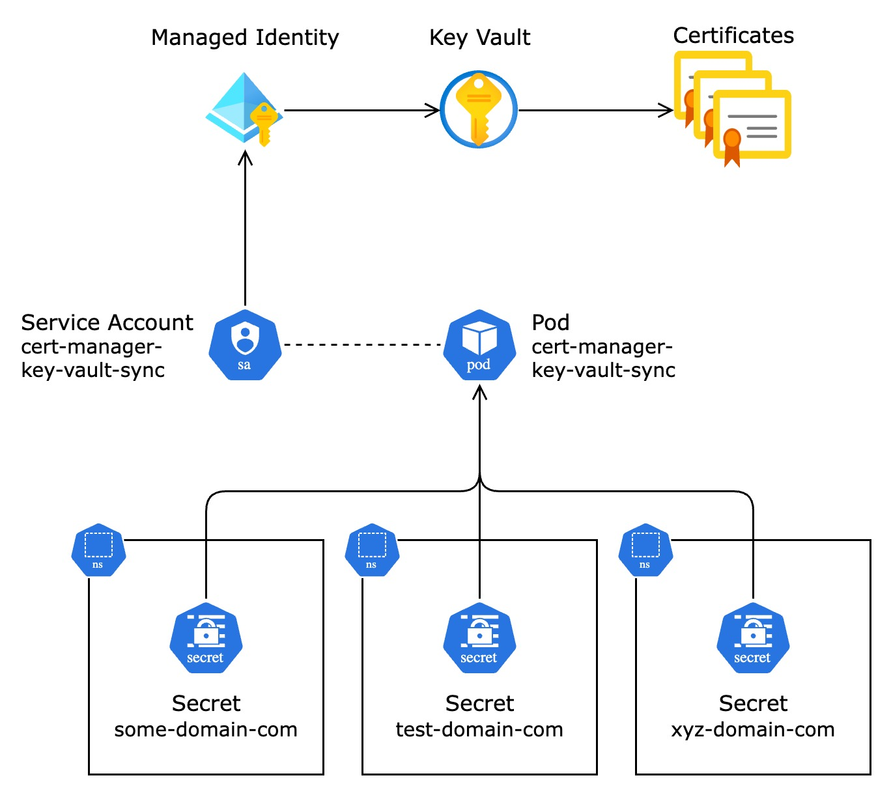

# cert-manager-key-vault-sync

Kubernetes app that syncs [cert-manager](https://cert-manager.io) Secrets to Azure Key Vault. Originally created with the intention of getting LetsEncrypt certficates into Key Vault, but works with any certificate stored in a Kubernetes Secret.

| Component   | Version | Status                                                                                                                                                                                                                                      |
| ----------- | ------- | ------------------------------------------------------------------------------------------------------------------------------------------------------------------------------------------------------------------------------------------- |
| Helm Chart  | v1.1.0  | [](https://github.com/rdvansloten/cert-manager-key-vault-sync/actions/workflows/build-push-helm-chart.yaml) |
| Application | v1.2.0  | [](https://github.com/rdvansloten/cert-manager-key-vault-sync/actions/workflows/build-push-image.yaml)         |

## Features

- Supports Kubernetes Nodes running `linux/amd64`, `linux/arm64` (Apple M1, Linux)
- Synchronizes Kubernetes Secrets to Azure Key Vault Certificates
- Allows for passwordless authentication using [Workload Identity](https://learn.microsoft.com/en-us/azure/aks/workload-identity-overview)
- Certificate is automatically rotated when cert-manager triggers a renewal
- Supports duplicate certificates in multiple Kubernetes Namespaces (e.g. `*.your-domain.com` in multiple Namespaces)
- Runs in a lightweight Alpine container, generally using < 128 MiB of memory
- Includes a [Helm Chart](#helm-installation) for easy installation

## In Progress

- Adding Key Vault authentication without Workload Identity (to accomodate home clusters, multi-cloud instances)

## Requirements & Limitations

- Running [cert-manager](https://cert-manager.io) `~> v1` in your Azure Kubernetes cluster
- Only syncs Kubernetes Secrets to Key Vault _Certificates_ (not to Key Vault _Secrets_)
- The included Helm chart only authenticates using [Workload Identity](https://learn.microsoft.com/en-us/azure/aks/workload-identity-overview) or Service Principal.

## Helm Installation

If you're running an older version of Helm, `HELM_EXPERIMENTAL_OCI=1` needs to be set to support OCI charts.

```sh
export HELM_EXPERIMENTAL_OCI=1
helm upgrade --install cert-manager-key-vault-sync \
    oci://docker.io/rdvansloten/cert-manager-key-vault-sync \
    --values ./charts/cert-manager-key-vault-sync/values.yaml \
    --version v1.1.0 \
    --namespace cert-manager-key-vault-sync --create-namespace
```

If you wish to use raw Kubernetes manifests instead, you may render the Helm template to plain YAML using the command below.

```sh
helm template cert-manager-key-vault-sync oci://docker.io/rdvansloten/cert-manager-key-vault-sync --version v0.3.0 \
    --values ./charts/cert-manager-key-vault-sync/values.yaml > output.yaml
```

## Authentication

### Workload Identity

When authenticating using Workload Identity, a Managed Identity (User Assigned Identity) has to exist in Azure with the correct permissions. The Managed Identity requires Key Vault Certificates Officer at the least, allowing it to read and write Key Vault Certificates.

```sh
az identity create \
  --resource-group "cert-manager-key-vault-sync" \
  --name "cert-manager-key-vault-sync"
```

Use the Client ID for the Managed Identity in [values.yaml](./charts/cert-manager-key-vault-sync/values.yaml).

```yaml
```yaml
azure:
  keyVaultName: "your-key-vault-here"
  workloadIdentity:
    clientId: "client-id-here"
    subscriptionId: "00000000-00000000-00000000-00000000"
    tenantId: "00000000-00000000-00000000-00000000"
```

In order to allow communication from/to Azure Kubernetes Service, a Federated Credential has to be created. First, retrieve the OIDC Cluster issuer URL from your Azure Kubernetes Service.

```sh
az aks show --name "your-cluster-name" \
  --resource-group "your-cluster-resource-group" \
  --query "oidcIssuerProfile.issuerUrl" \
  --output "tsv"
```

Now, create a federated credential. Don't forget the trailing `/` behind the URL, or this won't authenticate!

```sh
az identity federated-credential create \
  --name "cert-manager-key-vault-sync" \
  --identity-name "cert-manager-key-vault-sync" \
  --resource-group "cert-manager-key-vault-sync" \
  --issuer "https://your-oidc-cluster-issuer-url-here/" \
  --subject "system:serviceaccount:cert-manager-key-vault-sync:cert-manager-key-vault-sync" \
  --audiences "api://AzureADTokenExchange"
```

### Service Principal

When authenticating using a Service Principal, please make sure a Kubernetes Secret exists in this format, in the same Namespace. The `clientSecret` field is set to the password of the Service Principal. Reference the name of the Secret in [values.yaml](./charts/cert-manager-key-vault-sync/values.yaml), under `workloadIdentity.clientSecret`.

You may generate a Service Principal using Azure CLI:

```sh
az ad sp create-for-rbac \
  --name "cert-manager-keyvault-sync" \
  --role "Key Vault Certificates Officer" \
  --scopes "/subscriptions/YOUR-SUBSCRIPTION-ID-HERE"
```

```yaml
apiVersion: v1
kind: Secret
metadata:
  name: cert-manager-key-vault-sync-secret
  namespace: cert-manager-key-vault-sync
type: Opaque
stringData:
  clientSecret: client-secret-here
```

```yaml
azure:
  keyVaultName: "your-key-vault-here"
  workloadIdentity:
    clientId: "00000000-00000000-00000000-00000000"
    subscriptionId: "00000000-00000000-00000000-00000000"
    tenantId: "00000000-00000000-00000000-00000000"
    clientSecret: "cert-manager-key-vault-sync-secret
```

## Design

The synchronization process is a small Python3 application running on an Alpine image. It leverages OpenSSL to bundle the `.cer` and `.key` files, then uploads the resulting `.pfx` file to Azure Key Vault. cert-manager-key-vault-sync requires verbs `"get"`, `"list"`, `"watch"` on the `"secrets"` resource, as it needs to pull cert-manager-generated Secrets from all namespaces. It will only search for Secrets with the annotation `cert-manager.io/certificate-name` by default, though this can be changed.

The attached Service Account is connected to a Managed Identity in Azure, providing access to the Key Vault. The Managed Identity requires the `Key Vault Certificates Officer` role on the Key Vault, or a custom role with permissions to list, read, create and update Certificates and their metadata.

### Diagram



## Contributing

I'd love your input! I want to make contributing to this project as easy and transparent as possible, whether it's:

- Reporting [an issue](https://github.com/rdvansloten/cert-manager-key-vault-sync/issues/new?assignees=&labels=bug&template=bug_report.yml).
- Submitting [a fix](https://github.com/rdvansloten/cert-manager-key-vault-sync/compare).
- Proposing [new features](https://github.com/rdvansloten/cert-manager-key-vault-sync/issues/new?assignees=&labels=enhancement&template=feature_request.yml).
- Becoming a maintainer.
- Supporting my GitHub page through [GitHub Sponsors](https://github.com/sponsors/rdvansloten) or [ko-fi](https://ko-fi.com/V7V0WI9MI).

### All changes happen through Pull Requests

Pull requests are the best way to propose changes. I actively welcome your Pull Requests:

1. Fork this repository and create your branch from `main`.
2. If you've added code that should be tested, add some test examples.
3. Update the documentation.
4. Submit that Pull Request!
